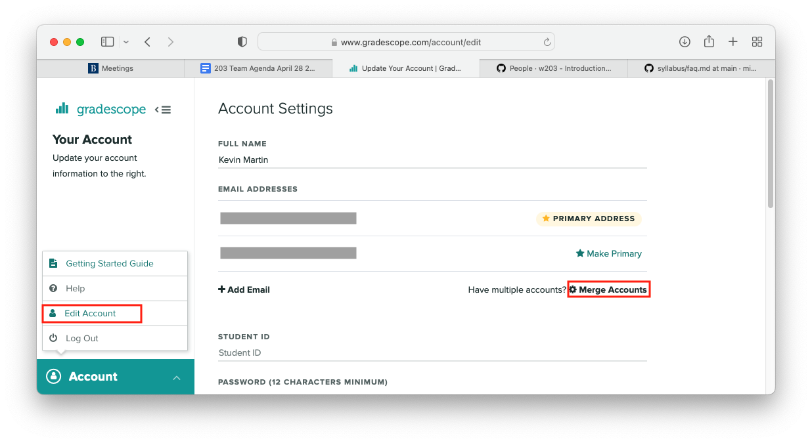

# Frequently Asked Questions

## The class doesn't show up when I log into Gradescope. What's the invite code?

>You don't need an invite code. You _probably_ haven't logged in correctly. 
>
>To get logged in to gradescope the first time please use the following steps:
>
>1. Click “Log In” in the upper right hand corner
>1. Put your **“@ischool.berkeley.edu”** email in on the email line (_Do **NOT** use your "@berkeley.edu" email_)
>1. Click “Forgot your Password?”
>1. Follow the reset link that gets sent  to your berkeley email
>1. Use your new password along with your **“@ischool.berkeley.edu”** email address to log in
>
>_Using the “School Credentials” option from the login won’t work and you’ll be taken to
>a screen without any courses available for you to view._
>
>If you tried the steps above and still don't have access then most likely you registered
>for the class after the gradescope roster was set up and we'll need to add you. In that 
>case, put a message with your @ischool.berkeley.edu email, and your section number in
>the #datasci-203-github-gradescope-requests channel on slack indicating that you need to 
>be added to the gradescope. 

## I already have a Gradescope login using my other (_@berkeley.edu_) email address. Can I merge the accounts?

>You definitely can. From the lower left hand corner of Gradescope click "Account". In the small pop up click "Edit Account". In the window that comes up hit "Merge Accounts" and follow the prompts.
>
>
>
> After you merge the accounts, you'll see all of your classes from both accounts in a single view. You'll also be able to log in from either account and end up at the same page.

## My GitHub invite expired, How do I access to the course repo?

>You just need another invite. We can send you a new one. 
>
>You'll need to give us your GitHub username and your section number. Drop both in the 
>#datasci-203-github-gradescope-requests channel on slack indicating that you need to 
>be added to the GitHub.
>
>If you don't have a GitHub account yet, just mention that and give one of your berkeley emails
>instead of your GitHub username. We can send the invite to the email and you'll be prompted 
>to create the account when you click through the invite. 

## I have access to the GitHub but I can't clone it. How do I clone it?

>Since late 2021, GitHub has required "personal access tokens" to access GitHub resouces from 
>the terminal. You can follow their docs to create one and then clone away. 
>https://docs.github.com/en/authentication/keeping-your-account-and-data-secure/creating-a-personal-access-token

## How do I find my section number?

> 1. Log in to [CalCentral](https://calcentral.berkeley.edu/)
> 1. Go to "My Academics" (at the top)
> 1. From the "Semesters" box, click "DATASCI W203" 
> 1. The section number is in the "Class Information" box. It's the 3 digit number following "WBL"
